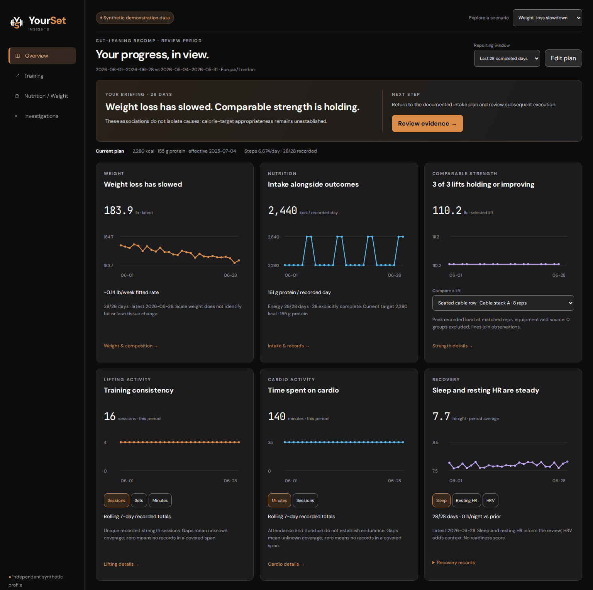
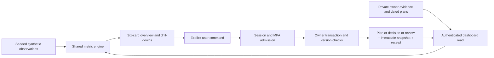

# YourSet Insights

A health and training dashboard for understanding progress when the signals disagree. It brings weight, nutrition, comparable lifts, activity and recovery into one review, then lets the user record a decision and return to its original evidence later.

Built by [Preston Keable](https://github.com/pkkeable), with AI-assisted implementation. The public demo uses independent synthetic records. No account, health export, model API or paid service is required.



## Try it locally

Install **Node.js 22 or later**, then run:

```sh
npm ci
npm run dev
```

Open **http://127.0.0.1:4173/**. The initial scenario is “Weight-loss slowdown”; its reference date is June 29, 2026. `npm run build` produces an allowlisted static site in `dist/`. Serve that directory at an origin root; no private API or database is included.

The synthetic demo keeps decisions in the current tab and resets on reload. The separate private runtime persists them to a local database; its disposable verification setup is **not yet a personal installation**.

## A short walkthrough

1. **Read the overview.** The assessment and next step lead into six charts: Weight, Nutrition, Comparable strength, Lifting activity, Cardio activity and Recovery. Switch activity units or recovery signals without losing the reporting window.
2. **Challenge the explanation.** Open Investigations. Compare supporting observations, conflicting evidence and gaps. More logged calories and fewer steps can accompany slower weight loss; the app does not assign causal percentages or prescribe a calorie cut.
3. **Choose what to do.** Accept a bounded action, write an adjustment, defer, reject or continue unchanged. Only an explicit target edit changes the dated plan.
4. **Return and review.** Load the independent synthetic follow-up, then finish a review. History retains the original assessment, plan and evidence snapshot alongside the later outcome. It never rewrites the earlier conclusion to fit what happened next.

Use the scenario selector to explore incomplete food logs, stale measurements, substituted exercises, conflicting signals and an unchanged plan. Details remain available below the overview and in Training and Nutrition / Weight.

## Why the calculations are conservative

A sync is not a complete food log. Weight is not a measurement of fat or lean tissue. A different machine is not a comparable lift. Missing recovery observations are not zeros.

One deterministic engine applies completed-day windows, dated targets, original writers, source revisions and exact exercise comparisons. The charts and narrative use those same results. There is no global readiness score, automatic numerical prescription, wearable-calorie adjustment or photo body-fat estimate.

## Architecture



The framework-free browser UI and static build keep the public demonstration easy to inspect. The private Node runtime uses PostgreSQL row-level security, server-mediated Supabase Auth/TOTP, opaque HttpOnly cookies and encrypted server-side tokens. An idempotency receipt commits with each command: a lost response can be retried without creating a second action. Private read failures show an unavailable state; they never substitute demo data.

| Read more | What it explains |
| --- | --- |
| [Metric contract](docs/METRICS.md) and [source model](docs/DATA_CONTRACT.md) | Windows, completeness, lineage, units, coverage and comparable lifts |
| [Command contracts](docs/COMMAND_CONTRACTS.md) | Atomic saves, immutable evidence, conflicts, retries and bounded reads |
| [Architecture decision](docs/adr/0001-write-and-session-boundary.md) | Why ownership and session admission are enforced separately |
| [Engineering findings](ENGINEERING.md) | Bugs and constraints that shaped the boundary |
| [Design](docs/DESIGN.md) | The approved six-card hierarchy and accessible drill-downs |
| [Capability matrix](docs/CAPABILITIES.md) | Dated evidence and what remains unproven |

## Verify it

```sh
npm run check
npm run build
```

`check` runs syntax, formatting, tracked-tree privacy checks and JavaScript tests. The repository's CI also runs the hash-pinned Python collector/reference tests and lint. Local integration tests exercise actual PostgreSQL, Auth, HTTP routes and Chromium, including owner isolation, MFA, rollback, retries, restart and mobile rendering:

```sh
npm run test:product-slice
npm run test:auth
```

Those two suites require the supported **macOS ARM + Docker Desktop** environment and download pinned service/browser images on first use. Follow [the local verification guide](dev/local/README.md); the runner refuses existing test resources and checks actual loopback bindings before use. See [supported platform](docs/SUPPORTED_PLATFORM.md) for exact versions and limitations.

## Current boundaries

The synthetic product and authenticated local decision loop are tested. Personal-source ingestion, a persistent Mac launcher, account recovery, backups and unattended refresh remain separate work. No hosted operation, provider account validation, physiological benefit or elapsed unattended trial is claimed. Hevy and Apple Health adapters are offline groundwork; Garmin is an optional candidate, and Strava is excluded. See [source capabilities](docs/SOURCES.md) and the [private runbook](docs/RUNBOOK.md).

Private configuration, records and operational reports belong outside source control. The public release uses a fresh reviewed source snapshot; it does not expose private repository history. [Privacy workflow](docs/PRIVACY_WORKFLOW.md) · [Publication boundary](docs/PUBLICATION.md).

## Attribution and rights

The source remains **UNLICENSED**, with no reuse rights granted. Public visibility is for review. The bundled DM Sans and JetBrains Mono assets retain their SIL Open Font License notices in `web/assets/`. The YourSet mark is owner-provided.

This software demonstration does not diagnose, treat or prescribe. Its comparisons have not been clinically validated.
